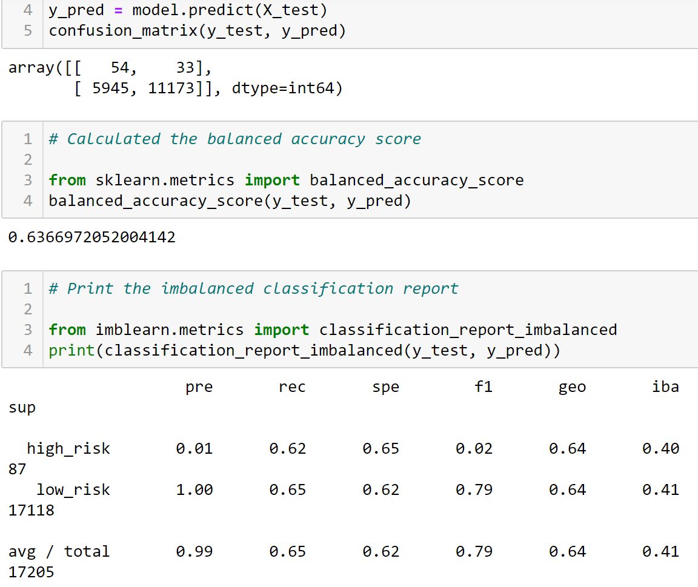
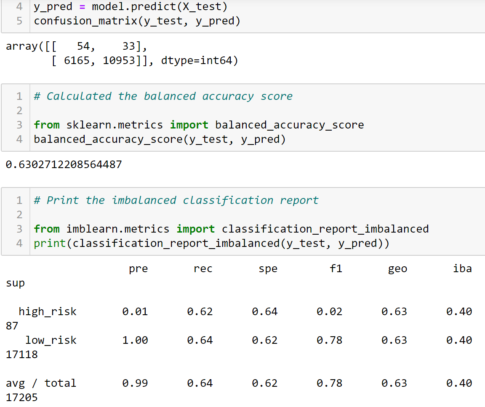
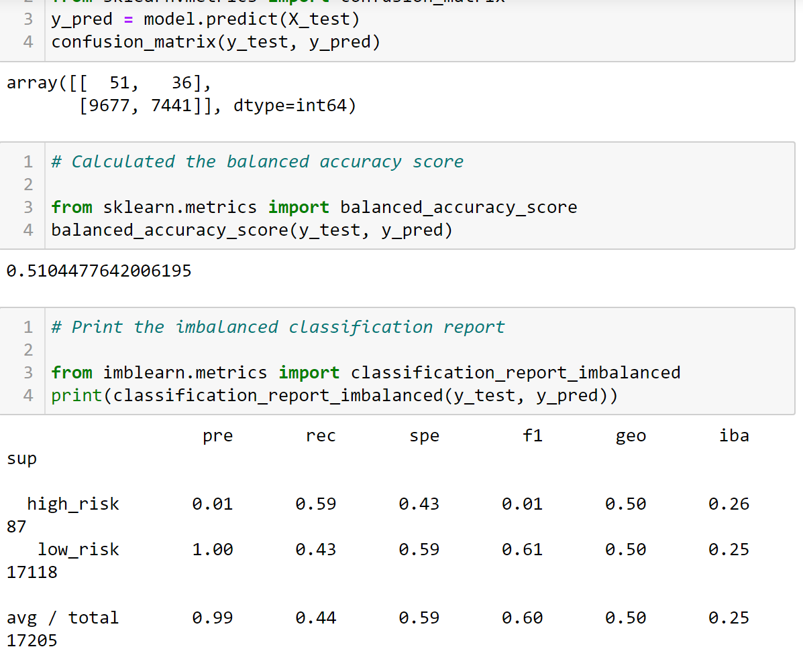
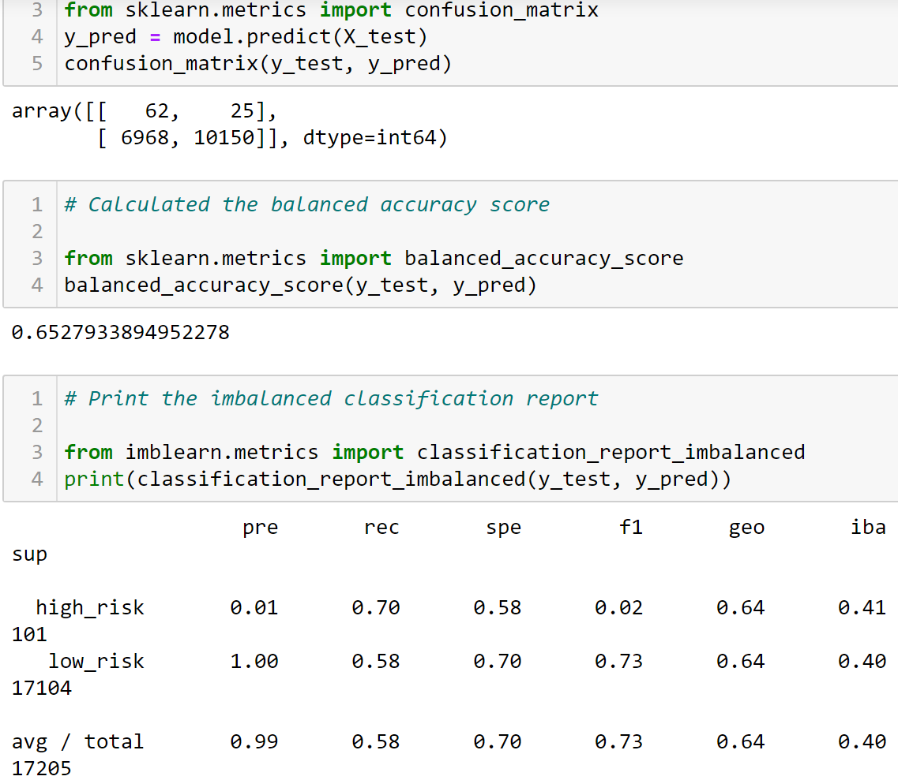
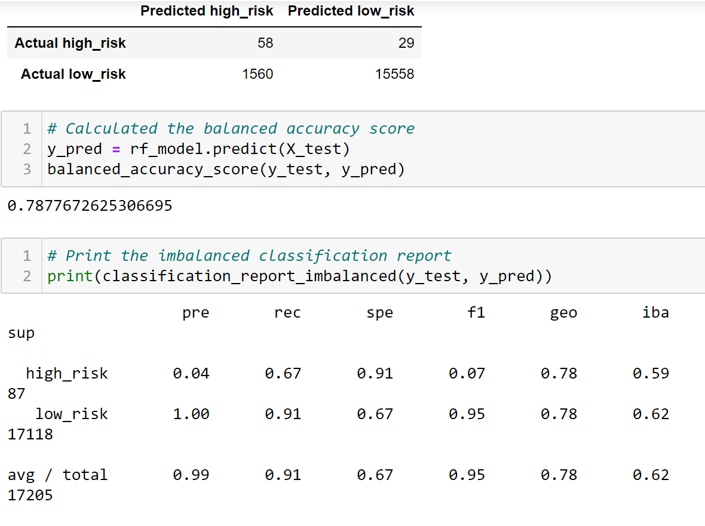
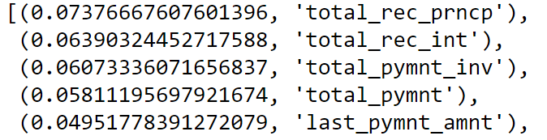
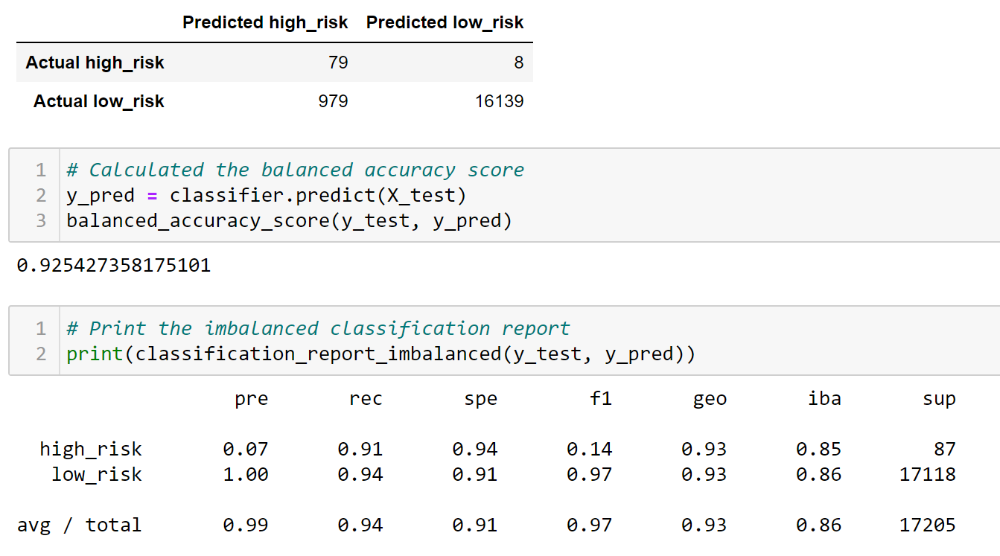

# Credit Risk Analysis
## Project Overview
The purpose of this analysis is to employ different Machine Learning techniques to train and evaluate models with unbalanced classes. Using credit card data, the goal is to determine whether or not certain machine learning models should be used to predict credit risk. The models utilized in this project are listed below:
- Naive Random Oversampling
- SMOTE (Synthetic Minority Oversampling Technique)
- ClusterCentroids Undersampling
- SMOTEENN (SMOTE and Edited Nearest Neighbors) Over-and-Under-sampling
- Balanced Random Forest Classifier
- Easy Ensemble AdaBoost Classifier

Resources:
Credit score risk dataset, Jupyter Notebook, Python and additional libraries: Pandas, NumPy, scikit-learn, and Imbalanced-learn 
## Results
### Naive  Random Oversampling
- Balanced accuracy score: 0.64
- Precison: high credit risk at 0.01, low credit risk at 1.00
- Recall (sensitivity): high credit risk at 0.62, low credit risk at 0.65

### SMOTE
- Balanced accuracy score: 0.63
- Precison: high credit risk at 0.01, low credit risk at 1.00
- Recall (sensitivity): high credit risk at 0.62, low credit risk at 0.64

### ClusterCentroids Undersampling
- Balanced accuracy score: 0.51
- Precison: high credit risk at 0.01, low credit risk at 1.00
- Recall (sensitivity): high credit risk at 0.59, low credit risk at 0.43

### SMOTEENN
- Balanced accuracy score: 0.65
- Precison: high credit risk at 0.01, low credit risk at 1.00
- Recall (sensitivity): high credit risk at 0.70, low credit risk at 0.58

### BalancedRandomForestClassifier
- Balanced accuracy score: 0.79
- Precison: high credit risk at 0.04, low credit risk at 1.00
- Recall (sensitivity): high credit risk at 0.67, low credit risk at 0.91
- Largest feature in this analysis was "total_rec_prncp" at 0.07.

### Easy Ensemble AdaBoost Classifier
- Balanced accuracy score: 0.93
- Precison: high credit risk at 0.07, low credit risk at 1.00
- Recall (sensitivity): high credit risk at 0.91, low credit risk at 0.94

## Summary and Recommendation
Looking at the results from various machine learning models, the model that had the strongest predictive power in predicting credit risk (high and low) was Easy Ensemble AdaBoost Classifier. Having an accuracy score at about 93%, this model is best suited for predicting credit risk.

